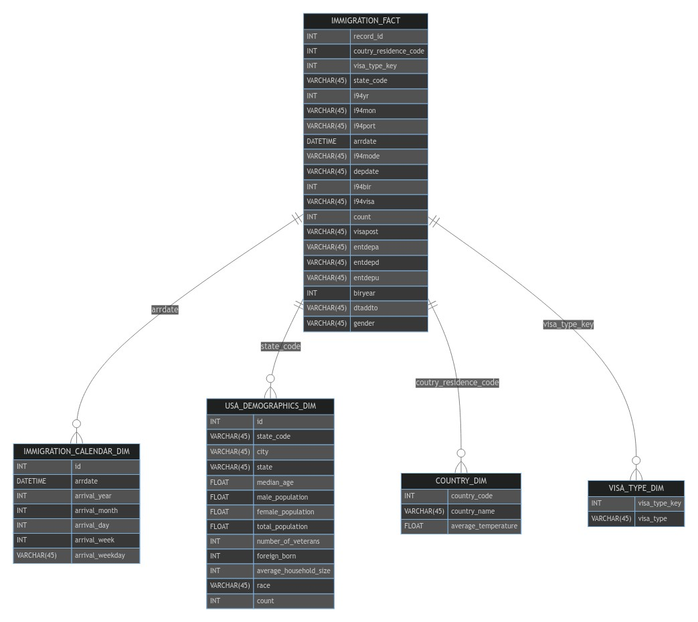

# Data Engineering Capstone Project

## Project Summary

The aim of this project was to develop an ETL pipeline for I94 immigration, global land temperatures, and US demographics datasets to form an analytics database on immigration events. This database can help identify immigration trends to the US. For instance, we might explore questions like whether people from countries with warmer or colder climates immigrate to the US in significant numbers.

## Data and Code

All data for this project was initially loaded into S3, except for the i94res.csv file, which was loaded into Amazon EMR's HDFS filesystem.

The project workspace includes the following files:

- **etl.py** - Reads data from S3, processes it using Spark, and writes the processed data back to S3 as a set of dimensional tables.
- **etl_functions.py and utility.py** - These modules contain functions for creating fact and dimension tables, data visualizations, and data cleaning.
- **config.cfg** - Configuration file that allows the ETL pipeline to access the AWS EMR cluster.
- **Jupyter Notebooks** - Used for building the ETL pipeline.

## Prerequisites

- AWS EMR cluster
- Apache Spark
- configparser
- Python 3 is required to run the Python scripts.

### The project follows these steps:

- Step 1: Scope the Project and Gather Data
- Step 2: Explore and Assess the Data
- Step 3: Define the Data Model
- Step 4: Run ETL to Model the Data
- Step 5: Complete Project Write-Up

## Step 1: Scope the Project and Gather Data

### Project Scope

To create the analytics database, the following steps were carried out:

- Use Spark to load the data into dataframes.
- Perform exploratory data analysis on the I94 immigration dataset to identify missing values and strategies for data cleaning.
- Perform exploratory data analysis on the demographics dataset to identify missing values and strategies for data cleaning.
- Perform exploratory data analysis on the global land temperatures by city dataset to identify missing values and strategies for data cleaning.
- Execute data cleaning functions on all datasets.
- Create dimension tables:
  - Create an immigration calendar dimension table from the I94 immigration dataset, linking to the fact table through the arrdate field.
  - Create a country dimension table from the I94 immigration and global temperatures datasets, with the latter aggregated at the country level. This table links to the fact table through the country of residence code, enabling analysts to understand the correlation between country climate and immigration to US states.
  - Create a USA demographics dimension table from the US cities demographics data, linking to the fact table through the state code field.
  - Create a fact table from the clean I94 immigration dataset and the visa_type dimension.

The technology used in this project includes Amazon S3 and Apache Spark. Data was read and staged from the customer repository using Spark.

## Step 2: Explore and Assess the Data

> Refer to the Jupyter notebook for exploratory data analysis

## Step 3: Define the Data Model

### 3.1 Conceptual Data Model



The country dimension table comprises data from the global land temperatures by city and the immigration datasets. Combining these datasets allows analysts to study correlations between global land temperatures and immigration patterns to the US.

The US demographics dimension table derives from the demographics dataset and links to the immigration fact table at the US state level. This dimension enables analysts to gain insights into migration patterns into the US based on demographics and overall state populations. Questions such as whether more populous states attract more visitors monthly could be explored. One could envision a dashboard designed based on this data model, with drill-downs into granular information on US visits. Such a dashboard could foster a data-driven decision-making culture within tourism and immigration departments at the state level.

The visa type dimension table comes from the immigration datasets and links to immigration via the visa_type_key.

The immigration fact table is the core of the data model. This table's data originates from the immigration datasets and contains keys that link to the dimension tables. The data dictionary of the immigration dataset provides detailed information on the data that constitutes the fact table.

### 3.2 Mapping Out Data Pipelines

The pipeline steps are as follows:

- Load the datasets
- Clean the I94 Immigration data to create Spark dataframes for each month
- Create the visa_type dimension table
- Create the calendar dimension table
- Extract and clean global temperatures data
- Create the country dimension table
- Create the immigration fact table
- Load demographics data
- Clean demographics data
- Create the demographics dimension table

## Step 4: Run Pipelines to Model the Data

### 4.1 Create the data model

> Refer to the Jupyter notebook for the data dictionary.

### 4.2 Running the ETL pipeline

The ETL pipeline is defined in the etl.py script, using the utility.py and etl_functions.py modules to create a pipeline that outputs final tables in Amazon S3.

```bash
spark-submit --packages saurfang:spark-sas7bdat:2.0.0-s_2.10 etl.py
```

## Author

- [Fahad Siddiqui](https://github.com/fahadsiddiqui)